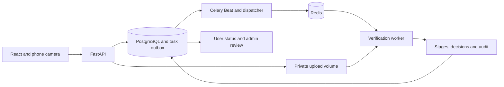

# Identity Verification System

[](https://github.com/didar-ali-deed/Identity-Verification-System/actions/workflows/ci.yml)


**AI-assisted identity verification with an evidence trail for every decision.**

Users submit identity documents and camera frames. A ten-stage pipeline extracts and compares fields, checks biometric and liveness evidence, screens an internal watchlist, and produces an approval, review referral or rejection. Reviewers can inspect the saved evidence and record an auditable decision.

Research and demonstration software. No production KYC certification or measured model accuracy is claimed.


[Watch the short demo recording](docs/demo.webm) · [Review scenario](docs/screenshots/review.png) · [Failure scenario](docs/screenshots/unavailable.png) · [Mobile preview](docs/screenshots/mobile.png)

## Try the showcase in two minutes

The public demo uses synthetic identities and illustrative scores. It runs without an account, backend, database, model downloads or personal documents.

```bash
cd frontend
npm ci
npm run dev
```

Open **http://localhost:5173/demo**. Switch between approval, OCR review, identity mismatch and unavailable liveness. Expand stages to inspect their evidence.

Docker alternative:

```bash
docker compose -f docker-compose.demo.yml up --build -d
```

Open **http://localhost:8081/demo**.

## What makes the pipeline different

- **Evidence before approval:** missing or failed face/liveness checks cannot be rescued by an aggregate score.
- **Multi-frame passive liveness:** optional MiniFASNet checks every frame; heuristic-only liveness requires review.
- **Document OCR:** EasyOCR detects and reads text on patterned documents. Missing or low-confidence fields require review.
- **Explainable decisions:** all completed stages, channel scores, flags, rule overrides and reasons are saved for users and reviewers.
- **Retries preserve decisions:** the application is locked while processing; replay returns its existing result.
- **Transactional job dispatch:** a PostgreSQL outbox prevents workers from racing uncommitted uploads.
- **Owned applications:** account authentication, role checks and application ownership protect read and write routes.
- **Replace unreadable documents:** resume a draft and upload a better capture before processing. Replacement clears old evidence and uses a fresh ID to isolate stale OCR jobs.
- **Phone capture:** an expiring, atomically consumed link supports camera capture on a second device.
- **Review safeguards:** reviewers can act only on review-ready applications; concurrent actions are serialized.
- **Reproducible checks:** backend regression/integration tests, desktop/mobile browser tests, lint, builds and dependency audits run in CI.

## Pipeline

| Stage | Evidence or action |
|---|---|
| 0 | Document classification, issuing-country registry and eligibility |
| 1 | Document screening and selfie passive liveness |
| 2 | OCR extraction, MRZ check digits and field confidence |
| 3 | Normalization, cross-zone consistency and expiry |
| 4 | Internal watchlist, duplicate and submission-velocity screening |
| 5 | Face, identity-number, name, father-name and DOB comparisons |
| 6 | Weighted synthesis: 40% face, 25% ID, 15% name, 10% father name, 10% DOB |
| 7 | Mandatory evidence gates and deterministic rule overrides |
| 8 | Approval, manual review or rejection |
| 9 | Saved evidence, application status and audit event |

Default score thresholds: **approval ≥0.90**, **review ≥0.75**, otherwise rejection. Rules take precedence. Missing comparison fields earn no perfect-match credit. An internal watchlist match requires human review.

The default CPU configuration uses heuristic liveness, so it cannot automatically approve. Configure a learned liveness model to exercise the automated approval path with real inputs; see [model setup](docs/models.md).

## Run the full application

Requirements: Docker Desktop, or Python 3.12 and Node.js 22 for local development.

On Windows:

```powershell
.\scripts\start.ps1
```

The script creates a private signing key if `.env` is missing, validates Compose, builds services and runs migrations. Existing configuration is preserved.

On other platforms:

```bash
cp .env.example .env
# Set JWT_SECRET_KEY to a unique random secret, e.g. openssl rand -hex 32.
docker compose up --build -d
```

| Service | Default local address |
|---|---|
| Application | http://localhost:8080 |
| API documentation | http://localhost:18000/api/docs |
| PostgreSQL | localhost:55432 |
| Redis | localhost:56379 |

Ports are configurable in `.env`. PostgreSQL, Redis and direct API ports bind to localhost. The development database credentials and HTTP proxy are for local use.

Register a user in the application.

For an OCR smoke test, register with the fictional profile name **Alex Sample**, open verification, and download the clearly marked passport and CNIC specimens from the form. Upload those images and inspect Document Review. These specimens are for extraction testing and should not establish identity or liveness. **Reset verification** on the form or status page deletes that verification's records/files and starts a new draft while keeping your account; it requires confirmation and is disabled during processing.

Create an administrator with a hidden password prompt:

```bash
docker compose exec backend python -m app.cli create-admin --email reviewer@example.com --name Reviewer
```

There are no default administrator credentials. First real inference downloads model assets. Camera capture on a phone requires an HTTPS address reachable from both devices.

See [development setup and operations](docs/development.md) for local Python commands, worker/Beat startup and migration notes.

## Stack and architecture

React 19, TypeScript, Vite, Tailwind CSS, TanStack Query and Zustand; FastAPI, SQLAlchemy, Alembic, PostgreSQL, Redis and Celery; EasyOCR, MediaPipe and DeepFace by default; optional InsightFace and MiniFASNet.



[Detailed architecture and limitations](docs/architecture.md) · [API examples](docs/api-examples.http) · [Model configuration and licenses](docs/models.md)

## Checks

```powershell
.venv\Scripts\python.exe -m ruff check backend\app backend\tests
.venv\Scripts\python.exe -m ruff format --check backend\app backend\tests
.venv\Scripts\python.exe -m pytest backend\tests -q
cd frontend
npm run lint
npm run build
npx playwright install chromium
npm run test:e2e
```

Database integration tests are skipped unless `IDV_INTEGRATION_TESTS=1` and a migrated, dedicated test database is configured. CI enables them. Browser tests cover every demo outcome, evidence expansion, responsive layouts and three-frame phone capture.

Tests use synthetic identities and model outputs. They verify application behavior, not real-world biometric or OCR accuracy.

See the [local upgrade validation report](docs/upgrade-validation.md) for the checks performed on this upgrade.

## Repository

```text
backend/app/
  api/                 authentication, uploads, ownership and review
  services/pipeline/   verification stages and saved evidence
  services/            OCR, biometric and passive liveness adapters
  models/              application, evidence, audit and job outbox
  tasks/               worker tasks and committed-job dispatcher
backend/tests/         regressions and PostgreSQL integration tests
frontend/src/          user/admin flows and synthetic demo
frontend/e2e/          desktop and mobile browser tests
scripts/               startup, model preparation and showcase capture
docs/                  architecture, setup, screenshots and recording
```

## License and scope

Application source is [MIT](LICENSE). Model weights have separate terms; InsightFace's supplied pretrained models are for non-commercial research. See [model licensing notes](docs/models.md).

Document authenticity checks remain heuristic. Server-verified active challenges, automatic retention, object-storage deployment and webhooks are future work. See [CONTRIBUTING.md](CONTRIBUTING.md) and [SECURITY.md](SECURITY.md).

Run and check: [run guide](docs/run-guide.md). Next work: [improvement plan](docs/improvement-plan.md).
