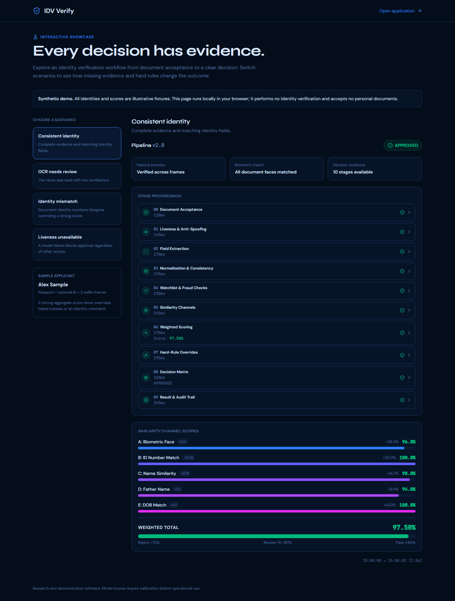
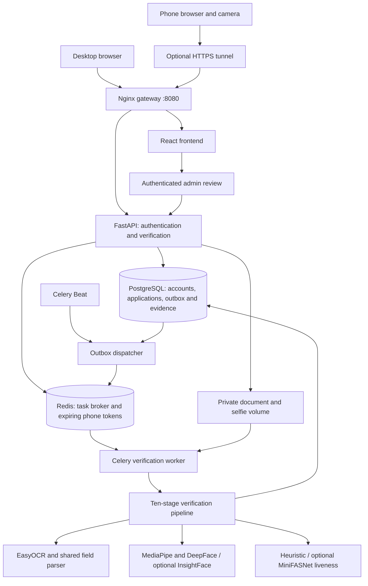

# Identity Verification System

[](https://github.com/didar-ali-deed/Identity-Verification-System/actions/workflows/ci.yml)


**AI-assisted identity verification with an evidence trail for every decision.**

Users submit identity documents and camera frames. A ten-stage pipeline extracts and compares fields, checks biometric and liveness evidence, screens an internal watchlist, and produces an approval, review referral or rejection. Reviewers can inspect the saved evidence and record an auditable decision.

Research and demonstration software. No production KYC certification or measured model accuracy is claimed.



[Watch the short demo recording](docs/demo.webm) · [Review scenario](docs/screenshots/review.png) · [Failure scenario](docs/screenshots/unavailable.png) · [Mobile preview](docs/screenshots/mobile.png)

## Try the showcase in two minutes

The public demo uses synthetic identities and illustrative scores. It runs without an account, backend, database, model downloads or personal documents.

```bash
cd frontend
npm ci
npm run dev
```

Open **http://localhost:5173/demo**. Switch between approval, OCR review, identity mismatch and unavailable liveness. Expand stages to inspect their evidence.

Docker alternative:

```bash
docker compose -f docker-compose.demo.yml up --build -d
```

Open **http://localhost:8081/demo**.

## What makes the pipeline different

- **Evidence before approval:** missing or failed face/liveness checks cannot be rescued by an aggregate score.
- **Multi-frame passive liveness:** optional MiniFASNet checks every frame; heuristic-only liveness requires review.
- **Document OCR:** EasyOCR detects and reads text on patterned documents. Missing or low-confidence fields require review.
- **Explainable decisions:** all completed stages, channel scores, flags, rule overrides and reasons are saved for users and reviewers.
- **Retries preserve decisions:** the application is locked while processing; replay returns its existing result.
- **Transactional job dispatch:** a PostgreSQL outbox prevents workers from racing uncommitted uploads.
- **Owned applications:** account authentication, role checks and application ownership protect read and write routes.
- **Replace unreadable documents:** resume a draft and upload a better capture before processing. Replacement clears old evidence and uses a fresh ID to isolate stale OCR jobs.
- **Phone capture:** an expiring, atomically consumed link supports camera capture on a second device.
- **Review safeguards:** reviewers can act only on review-ready applications; concurrent actions are serialized.
- **Reproducible checks:** backend regression/integration tests, desktop/mobile browser tests, lint, builds and dependency audits run in CI.

## Pipeline

| Stage | Evidence or action |
|---|---|
| 0 | Document classification, issuing-country registry and eligibility |
| 1 | Document screening and selfie passive liveness |
| 2 | OCR extraction, MRZ check digits and field confidence |
| 3 | Normalization, cross-zone consistency and expiry |
| 4 | Internal watchlist, duplicate and submission-velocity screening |
| 5 | Face, identity-number, name, father-name and DOB comparisons |
| 6 | Weighted synthesis: 40% face, 25% ID, 15% name, 10% father name, 10% DOB |
| 7 | Mandatory evidence gates and deterministic rule overrides |
| 8 | Approval, manual review or rejection |
| 9 | Saved evidence, application status and audit event |

Default score thresholds: **approval ≥0.90**, **review ≥0.75**, otherwise rejection. Rules take precedence. Missing comparison fields earn no perfect-match credit. An internal watchlist match requires human review.

The default CPU configuration uses heuristic liveness, so it cannot automatically approve. Configure a learned liveness model to exercise the automated approval path with real inputs; see [model setup](docs/models.md).

## Run the full application

Requirements: Docker Desktop, or Python 3.12 and Node.js 22 for local development.

On Windows:

```powershell
.\scripts\start.ps1
```

The script creates a private signing key if `.env` is missing, validates Compose, builds services and runs migrations. Existing configuration is preserved.

On other platforms:

```bash
cp .env.example .env
# Set JWT_SECRET_KEY to a unique random secret, e.g. openssl rand -hex 32.
docker compose up --build -d
```

| Service | Default local address |
|---|---|
| Application | http://localhost:8080 |
| API documentation | http://localhost:18000/api/docs |
| PostgreSQL | localhost:55432 |
| Redis | localhost:56379 |

Ports are configurable in `.env`. PostgreSQL, Redis and direct API ports bind to localhost. The development database credentials and HTTP proxy are for local use.

Register a user in the application.

For an OCR smoke test, register with the fictional profile name **Alex Sample**, open verification, and download the clearly marked passport and CNIC specimens from the form. Upload those images and inspect Document Review. These specimens are for extraction testing and should not establish identity or liveness. **Reset verification** on the form or status page deletes that verification's records/files and starts a new draft while keeping your account; it requires confirmation and is disabled during processing.

Create an administrator with a hidden password prompt:

```bash
docker compose exec backend python -m app.cli create-admin --email reviewer@example.com --name Reviewer
```

There are no default administrator credentials. First real inference downloads model assets. Camera capture on a phone requires an HTTPS address reachable from both devices.

See [development setup and operations](docs/development.md) for local Python commands, worker/Beat startup and migration notes.

## Stack and architecture

React 19, TypeScript, Vite, Tailwind CSS, TanStack Query and Zustand; FastAPI, SQLAlchemy, Alembic, PostgreSQL, Redis and Celery; EasyOCR, MediaPipe and DeepFace by default; optional InsightFace and MiniFASNet.



[Detailed architecture and limitations](docs/architecture.md) · [API examples](docs/api-examples.http) · [Model configuration and licenses](docs/models.md)

## Checks

```powershell
.venv\Scripts\python.exe -m ruff check backend\app backend\tests
.venv\Scripts\python.exe -m ruff format --check backend\app backend\tests
.venv\Scripts\python.exe -m pytest backend\tests -q
cd frontend
npm run lint
npm run build
npx playwright install chromium
npm run test:e2e
```

Database integration tests are skipped unless `IDV_INTEGRATION_TESTS=1` and a migrated, dedicated test database is configured. CI enables them. Browser tests cover every demo outcome, evidence expansion, responsive layouts and three-frame phone capture.

Tests use synthetic identities and model outputs. They verify application behavior, not real-world biometric or OCR accuracy.

See the [local upgrade validation report](docs/upgrade-validation.md) for the checks performed on this upgrade.

## Repository

```text
backend/app/
  api/                 authentication, uploads, ownership and review
  services/pipeline/   verification stages and saved evidence
  services/            OCR, biometric and passive liveness adapters
  models/              application, evidence, audit and job outbox
  tasks/               worker tasks and committed-job dispatcher
backend/tests/         regressions and PostgreSQL integration tests
frontend/src/          user/admin flows and synthetic demo
frontend/e2e/          desktop and mobile browser tests
scripts/               startup, model preparation and showcase capture
docs/                  architecture, setup, screenshots and recording
```

## License and scope

Application source is [MIT](LICENSE). Model weights have separate terms; InsightFace's supplied pretrained models are for non-commercial research. See [model licensing notes](docs/models.md).

Document authenticity checks remain heuristic. Server-verified active challenges, automatic retention, object-storage deployment and webhooks are future work. See [CONTRIBUTING.md](CONTRIBUTING.md) and [SECURITY.md](SECURITY.md).

Run and check: [run guide](docs/run-guide.md). Next work: [improvement plan](docs/improvement-plan.md).

## End-to-end verification workflow

1. **Create an account.** Register a profile and sign in. Authentication identifies the owner of each application; administrators use a separate role.
2. **Create a verification draft.** Upload a passport and national ID. Files are stored privately, and OCR jobs are requested through the transactional outbox.
3. **Review extracted information.** Compare the profile name, document names, DOB and gender. Missing OCR is shown separately from a mismatch. Passport nationality and CNIC country of stay describe different facts and are not treated as conflicting citizenship evidence. Each document's expiry is checked independently.
4. **Replace unreadable captures.** Before processing, upload a clearer document if needed. Replacement clears superseded evidence so an earlier OCR job cannot overwrite the replacement.
5. **Capture a selfie.** Use the desktop webcam or an expiring phone link. The phone flow captures three frames and sends them to the same application.
6. **Wait for processing.** The worker runs the pipeline and stores its complete result. The status screen displays channel scores, stage evidence, flags and reason codes.
7. **Inspect the decision.** Expand stages rather than interpreting the total score alone. A successful stage execution does not mean every check inside that stage passed.
8. **Review or retry.** Authorized reviewers handle review-ready applications. The explicit reset action removes the current verification and its files while retaining the account. Completed pipeline results are otherwise reused on duplicate task delivery.

## Understanding results

| Signal | Meaning | What to inspect |
|---|---|---|
| Name / DOB / identity number match | Extracted values agree after normalization | Stages 2, 3 and 5; agreement alone does not authenticate a document |
| Father name unavailable | Cross-document comparison lacks a value and receives zero credit | Both extracted fields; missing evidence is distinct from a measured mismatch |
| Biometric comparison error | Face comparison could not produce usable evidence | Stage 5 comparison errors and worker traceback |
| Biometric non-match | The model produced evidence that did not satisfy verification | Document-specific distance and verification results |
| Liveness human review required | Heuristic checks did not provide learned PAD verification | Stage 1 and selected liveness backend |
| MRZ missing or invalid | The machine-readable zone was not read or failed check-digit validation | Stage 2; visible fields can still be extracted successfully |
| Expiry valid | That document's extracted expiry has not passed | Stage 3; two documents may have different expiry dates |
| Fraud percentage | A heuristic screening score | Individual checks; it is not a calibrated probability of fraud |

Biometric matching requires successful comparisons against **every submitted identity document**. The default DeepFace adapter validates face crops with MediaPipe before producing embeddings; images with no detected face or multiple detected faces are refused. Provider exceptions retain their underlying cause in worker logs. This path has regression coverage, but the latest changes still need a fresh end-to-end Docker verification on real captures.

Mandatory gates take precedence over the weighted total. A high document-text score cannot compensate for failed biometric evidence. Heuristic liveness cannot grant automatic approval. Configuring a learned provider also requires licensed assets, evaluation and appropriate thresholds; installation alone does not establish accuracy.

## Mobile verification, step by step

Start the full application first. With `cloudflared` installed, open a second PowerShell window at the repository root:

```powershell
.\scripts\start-phone.ps1
```

Keep that terminal open. Open the printed **HTTPS URL on the desktop**, sign in, and select **Take a Selfie → Use phone**. Scan the newly generated QR code on the phone, allow camera access and follow the capture instructions. The QR address follows the desktop page's origin: generating it from `http://localhost:8080` produces a localhost link that cannot reach your PC from the phone.

With the public HTTPS tunnel, the devices can use different networks. A direct LAN connection requires the phone to reach the PC on the local network, and phone camera access needs a secure browser context. The helper currently targets port **8080**; if you change `HTTP_PORT`, adjust the tunnel target accordingly. Restarting the helper produces a new URL. Existing QR links expire after ten minutes and are single-use.

## Daily Docker operations

Run these from the repository root:

```powershell
# Build changes and start the application.
.\scripts\start.ps1

# Start existing images again without rebuilding.
docker compose up -d --wait --wait-timeout 180

# Check services and inspect processing logs.
docker compose ps
docker compose logs --tail=100 backend celery-worker

# Stop services while keeping named volumes.
docker compose down
```

The full stack has **seven services**: gateway, frontend, backend, worker, scheduler, database and broker. Multiple containers are expected because these services have different responsibilities. The backend, worker and scheduler share the same application build context and Docker layers.

Named volumes retain PostgreSQL records, Redis state, uploads and mounted model caches. `docker compose down -v` deletes the project's named volumes; use it only for an intentional destructive reset. Resetting one verification through the UI is more limited than deleting the database.

First builds download large AI dependencies, including TensorFlow. First inference may download additional model weights. The ML installation uses BuildKit's pip download cache and resume retries while keeping package hash verification enabled. Model assets stored outside mounted cache directories may download again when containers are recreated.

## Configuration reference

Copy `.env.example` for the complete set of local settings. The startup script creates a private root `.env` when absent; never commit it.

| Setting | Default | Purpose |
|---|---|---|
| `JWT_SECRET_KEY` | Generated by the Windows startup script | Signs authentication tokens; required by Compose |
| `HTTP_PORT` | `8080` | Browser gateway |
| `API_PORT` | `18000` | Direct local API and documentation |
| `POSTGRES_PORT` / `REDIS_PORT` | `55432` / `56379` | Local database and broker access |
| `FACE_BACKEND` | `deepface` | Face comparison provider; optional `insightface` |
| `FACE_MODEL` | `Facenet` | DeepFace recognition model |
| `LIVENESS_BACKEND` | `heuristic` | Default review-only liveness or optional learned provider |
| `LIVENESS_THRESHOLD` | `0.75` | Liveness acceptance threshold |
| `PIPELINE_PASS_THRESHOLD` | `0.90` | Score threshold after mandatory evidence gates |
| `PIPELINE_REVIEW_THRESHOLD` | `0.75` | Review score threshold when no override applies |
| `INSTALL_ENHANCED` | `false` | Include optional enhanced inference dependencies during image build |
| `INFERENCE_USE_GPU` | `false` | Inference GPU preference; see the GPU configuration |

Compose supplies container database URLs, upload paths and runtime settings. Local Python development uses the localhost addresses from `.env.example`. Changing an image build argument requires rebuilding; changing service environment requires recreating the affected containers. See [model setup](docs/models.md) for supported providers, assets and licenses.

## Troubleshooting

| Problem | Next step |
|---|---|
| Build is still downloading packages | Leave the terminal running; the first inference image is large |
| Package hash mismatch | Retry the build; preserve hash verification and share the failing download line if it recurs |
| Phone QR contains HTTP or localhost | Open the tunnel's HTTPS URL on the desktop, then generate a new QR |
| Tunnel URL stopped working | Check the tunnel terminal; restart the helper and use its new URL |
| Camera permission denied | Allow camera access for that HTTPS origin in the phone browser |
| Text matches but application is rejected | Inspect biometric evidence, liveness and hard-rule overrides |
| Face error hides the underlying cause | Rebuild to include the latest adapter and inspect worker logs |
| An old result still appears after a rebuild | Completed results are saved snapshots; use a new verification attempt to test changed code |
| Services stopped after `docker compose down` | Start existing images with `docker compose up -d --wait --wait-timeout 180` |

## Engineering status and next steps

Completed work includes a shared EasyOCR parser for document review and pipeline extraction, shared date normalization, removal of unused services and redundant configuration, Docker download retries, phone capture, transactional dispatch, evidence persistence and fail-closed biometric gates. Recent targeted validation passed **45 tests** covering face-comparison behavior, spatial OCR, pipeline fields and evidence rules, alongside Ruff lint and formatting checks. These tests simulate providers; they do not measure real recognition performance.

Remaining priorities are real-capture biometric validation, passport MRZ and father-name extraction evaluation across layouts, learned liveness evaluation, model/version pinning, consented benchmark data, retention jobs and production storage. The latest face/parser changes have **not yet been verified through a fresh full Docker workflow**. Follow the [improvement plan](docs/improvement-plan.md) rather than weakening verification gates to obtain an approval.
