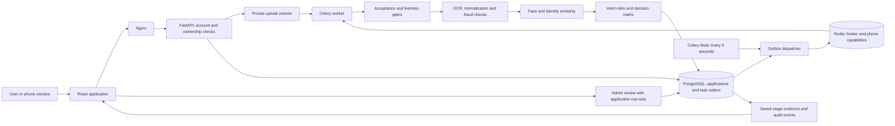

# Architecture and evidence flow

## Decision authority

The ten-stage pipeline is the sole automated decision authority. Uploads do not accept caller-supplied scores, decisions or liveness verdicts. The former `legacy` and `both` modes are rejected by configuration validation so a second pipeline cannot race the final decision.

1. OCR is run before the acceptance gate, so country and document checks do not depend on whether an earlier background task finished first.
2. Passive liveness and biometric evidence must be present. MiniFASNet requires 3–10 frames; every frame must pass. Heuristic liveness alone can only lead to manual review, never automatic approval.
3. Every submitted identity document needs a successful face comparison. A missing or failed second comparison cannot be hidden by a successful first one.
4. Missing cross-document fields receive zero evidence credit. Identity-number and DOB mismatches override an aggregate score; possible DOB transpositions and name discrepancies require review.
5. The default score thresholds are approval at 0.90 and review at 0.75. Rules are evaluated before thresholds. A watchlist match requires human review because it is an internal screening signal, not a confirmed external sanctions finding.

## Transactions and retries

Uploads and their job requests are committed in one transaction using a PostgreSQL outbox. A dispatcher publishes only committed jobs. Publication is **at least once**: a crash between publication and marking an outbox row can produce duplicates.

The pipeline locks the application row and returns its existing result on replay. It does not replace a completed snapshot or undo a reviewer's decision. All completed stages, including skipped-stage gaps, are persisted. Automated completion and reviewer decisions produce separate audit events. Database administrators can still alter records; this is not a cryptographically tamper-proof audit system.

Concurrent submissions are constrained by a partial unique index. Uploads and reviews also lock their application row. Review actions are accepted only in `ready_for_review` state.

## Storage and phone handoff

Files live in a private shared volume and are never served as a public static directory. Filesystem paths are checked against the resolved upload root, including sibling-directory and symlink traversal. PostgreSQL stores paths and extracted evidence.

Phone links carry a random capability stored in Redis for ten minutes. `GETDEL` consumes it atomically. An invalid or failed upload may require a new link from the desktop. Phone URLs are excluded from Nginx access logs; referrer headers are disabled. Camera access requires HTTPS, except on localhost.

The server checks passive liveness of uploaded frames. It does **not** independently prove camera provenance or validate a blink/head-turn challenge. A browser can submit arbitrary frames; passive PAD alone does not eliminate injection attacks.

## Current limits

Document FFT, ELA, layout and texture checks are heuristics, not government document authentication. OCR confidence is an uncalibrated model likelihood, not a probability that an identity is correct. No operational accuracy or presentation-attack certification is claimed.

Automatic retention, an S3 storage implementation, delivery webhooks and server-verified active challenges from the separate KYC project are not yet part of this repository. They should be added with explicit lifecycle and failure semantics rather than copied blindly.
