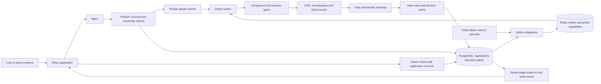
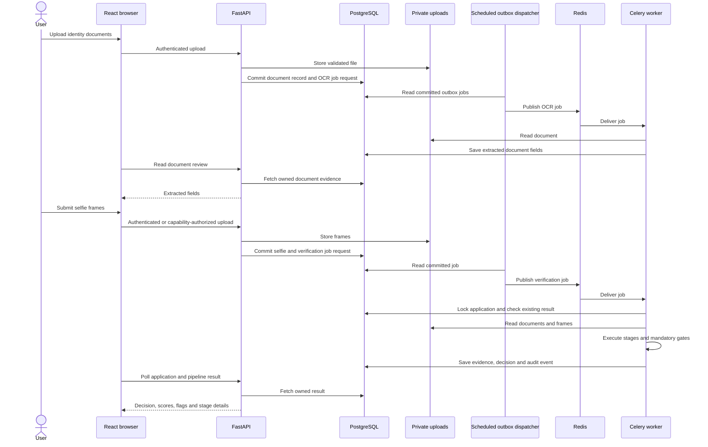
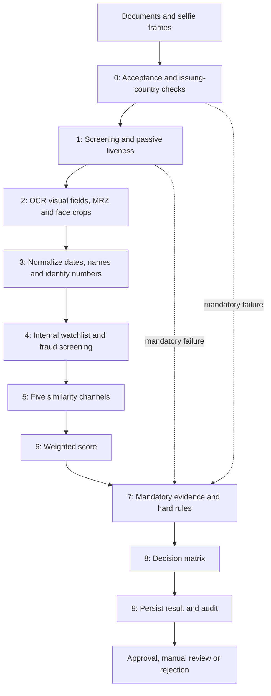
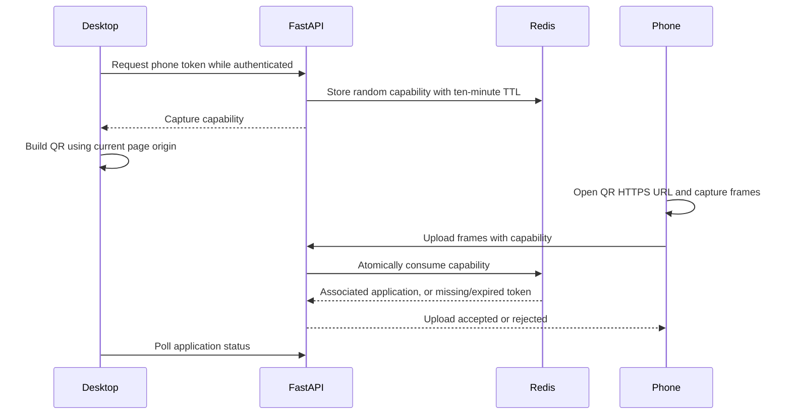

# Architecture and evidence flow

## Decision authority

The ten-stage pipeline is the sole automated decision authority. Uploads do not accept caller-supplied scores, decisions or liveness verdicts. The obsolete pipeline-mode switch and separate legacy scoring path have been removed.

1. OCR is run before the acceptance gate, so country and document checks do not depend on whether an earlier background task finished first.
2. Passive liveness and biometric evidence must be present. MiniFASNet requires 3–10 frames; every frame must pass. Heuristic liveness alone can only lead to manual review, never automatic approval.
3. Every submitted identity document needs a successful face comparison. A missing or failed second comparison cannot be hidden by a successful first one.
4. Missing cross-document fields receive zero evidence credit. Identity-number and DOB mismatches override an aggregate score; possible DOB transpositions and name discrepancies require review.
5. The default score thresholds are approval at 0.90 and review at 0.75. Rules are evaluated before thresholds. A watchlist match requires human review because it is an internal screening signal, not a confirmed external sanctions finding.

## Deployment boundaries

| Component | Responsibility | Durable state |
|---|---|---|
| Nginx gateway | Routes browser and API traffic through one origin | Repository configuration |
| Frontend container | Serves compiled React assets and synthetic showcase | No application database |
| FastAPI backend | Authentication, ownership, uploads, status and reviewer actions | PostgreSQL and private uploads |
| Celery worker | OCR and ten-stage verification jobs | Saved evidence and decisions in PostgreSQL |
| Celery Beat | Schedules committed-job dispatch | Scheduler state is not the verification result authority |
| PostgreSQL | Accounts, applications, documents, stage results, audit and outbox | `postgres_data` volume |
| Redis | Task delivery, task results and expiring phone capabilities | `redis_data` volume |

The backend and worker share an upload volume. EasyOCR and optional InsightFace use mounted model caches; not every third-party model directory is mounted. Direct API, PostgreSQL and Redis host ports bind to loopback. The gateway is exposed on the configured HTTP port. An optional development tunnel terminates public HTTPS and forwards traffic to the local gateway; it is not an eighth Compose service.

## Submission sequence

The diagram describes the normal flow. Upload file operations and database transactions are different storage boundaries; the transactional outbox coordinates database records and job publication, not a distributed filesystem transaction.

## Pipeline data flow

Early mandatory failures can skip later evidence stages while retaining the completed stage results. The decision layer records missing mandatory evidence rather than treating skipped work as successful.

Visual fields and MRZ fields retain separate provenance. Review and pipeline share the visual parser, but a valid visible name cannot substitute for an unread or invalid MRZ. Date normalization is shared by OCR and the consistency stage. Passport nationality and national-ID residence are not compared as interchangeable fields.

For the default face adapter, MediaPipe detects a single face in each comparison image. The adapter crops those detections and sends BGR arrays to DeepFace for embeddings and distance computation without another OpenCV detection pass. The single-face gate remains mandatory; no-face and multi-face images produce errors. The optional InsightFace adapter has its own detection and comparison path. Both submitted documents must yield successful comparisons before biometric evidence is considered verified.

Provider errors and measured non-matches both prevent biometric approval, but they are different diagnostic outcomes. Wrapped DeepFace errors preserve the underlying cause in worker logs and comparison evidence. These diagnostics need operational handling and representative-input evaluation before production use.

## Phone capability flow

Desktop and phone must use a mutually reachable origin. A public HTTPS tunnel supports separate networks. A QR generated from a desktop localhost page instead refers to localhost on the phone. The phone token authorizes one upload to one application; it does not grant general account access.

## Transactions and retries

Uploads and their job requests are committed in one transaction using a PostgreSQL outbox. A dispatcher publishes only committed jobs. Publication is **at least once**: a crash between publication and marking an outbox row can produce duplicates.

The pipeline locks the application row and returns its existing result on replay. It does not replace a completed snapshot or undo a reviewer's decision. All completed stages, including skipped-stage gaps, are persisted. Automated completion and reviewer decisions produce separate audit events. Database administrators can still alter records; this is not a cryptographically tamper-proof audit system.

Concurrent submissions are constrained by a partial unique index. Uploads and reviews also lock their application row. Review actions are accepted only in `ready_for_review` state.

## Storage and phone handoff

Files live in a private shared volume and are never served as a public static directory. Filesystem paths are checked against the resolved upload root, including sibling-directory and symlink traversal. PostgreSQL stores paths and extracted evidence.

Phone links carry a random capability stored in Redis for ten minutes. `GETDEL` consumes it atomically. An invalid or failed upload may require a new link from the desktop. Phone URLs are excluded from Nginx access logs; referrer headers are disabled. Camera access requires HTTPS, except on localhost.

The server checks passive liveness of uploaded frames. It does **not** independently prove camera provenance or validate a blink/head-turn challenge. A browser can submit arbitrary frames; passive PAD alone does not eliminate injection attacks.

## Current limits

Document FFT, ELA, layout and texture checks are heuristics, not government document authentication. OCR confidence is an uncalibrated model likelihood, not a probability that an identity is correct. No operational accuracy or presentation-attack certification is claimed.

Automatic retention, an S3 storage implementation, delivery webhooks and server-verified active challenges from the separate KYC project are not yet part of this repository. They should be added with explicit lifecycle and failure semantics rather than copied blindly.
